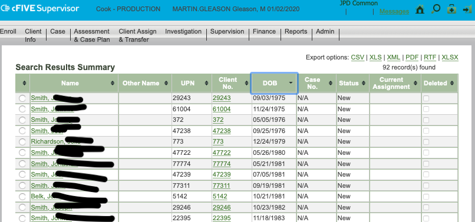

```{r loadscripts, echo=FALSE, message=FALSE, warning=FALSE}
library(here)
library(kableExtra)
data_source <- here("scripts/data_exercises.R")
source(data_source)

```
#Learning Objectives

* Learn how field work becomes data work.

* Become familiar with tidy data principles.

* Develop a basic understanding of SQL and what is used for.

* Learn where to continue studying SQL and Database Administration

---
# Grounding and Icebreaker
.pull-left[
*On the card in front of you write the following:*
  * Name
  
  * Extension
  
  * What you want out of this training?
  
  * Spotify, iTunes, or analog
  
  * Favorite social network
    * Facebook, twitter, tumblr, instagram, reddit, other...
]

.v-middle[.pull-right[]]

---
## Step 2: Sort this data!
.center[]
---
# What is tidy data?
.center[]

---
# Tidy Data Principles
.pull-left[
### Academic Terms
1. Each variable is atomic 

2. Each variable forms a column

3. Each observation forms a row

4. Each type of observational unit forms a table
]
.pull-right[
### Real Life Examples
1. Separating first and last names

2. First Name Column, DOB Columns

3. Martin, Gleason, 7/14/197

4. Birthday Table
]

.footnote[Source: [Hadley Wickham's Paper](https://vita.had.co.nz/papers/tidy-data.pdf)]

---
# Exercise #1: Tidy This Table
```{r clerks_table, echo = FALSE}

clerks[1:20, 1:4] %>% 
  kable(cation = "Clerks Training Data from OCS") %>%
  kable_styling(bootstrap_options= c("responsive","striped")) %>% 
  scroll_box(width = "100%", height = "75%")
```

---
# Exercise #1 Results

.pull-left[
1. Each variable is atomic 

2. Each variable forms a column

3. Each observation forms a row

4. Each type of observational unit forms a table
]

.pull-right[
1. Names are not atomic

2. Missing First Name, Last Name

3. More than one "observation"

4. It is one table. Should it be?
]

---
# Database vs Spreadsheet: 
##Completely Oversimplified

.pull-left[
  * **Spreadsheets:**
    * Collect and track whatever you want however you want.

* **Database:**
    * Stricter rules about what can go where and how it is displayed. 
    * Scalability
]

.pull-right[

]

---
# Exercise 2: Think Like A Spreadsheet
.pull-left[]
.pull-right[
**As a group, make a spreadsheet that tracks:**

  * Customer info
  * Store order
  * What they ordered
  * Delivery method
  * Making a return
]

???
use note cards and sticky notes
---

#Databases and SQL: A Little Bit of Theory

  * [Databases are built on Set Theory](https://medium.com/basecs/set-theory-the-method-to-database-madness-5ec4b4f05d79)

  * Tidy principles are a simplification of normalization

    * Deconstructing relationships to their most basic elements

 
  * Structured Query Language was created in 1970 by IBM
  
  * There are many flavors of SQL for working with a variety of database products
  
---

# Database Products

  * Oracle: **MySQL**, Oracle Database

  * Microsoft: Access, **Microsoft SQL Server**
  
  * PostgreSQL Global Development Group: **PostgreSQL**
  
  * SQLite Consortium: **SQLite**
  
  * IBM: DB2
  
  * SAP: SAP Sybase

---

# Database Products

  * **MySQL:** Hugely popular for websites, free, and used by a number of online learning companies because it is ubiquitous.
  
  * **SQL Server:** Hugely popular with companies who use Microsoft products. 
    * What `JEMS` used and `cFive` WILL use
  
  * **PostgreSQL:** Free, fast, and well supported by a community of developers
  
  * **SQLite:** Free, popular for tablets/phones. 
    * Use a single file structure where other products use multiple, interlinked files
  
---

# Database vs Database Administration

.pull-left[
  * Rules, logins, who can access what data: Database Administration
    * Uses command line or a graphic user interface
    * Is not always a SQL command
    
  * Loading, Accessing, Transforming, and Manipulating Data
    * This is done by SQL
    
]

.pull-right[
Microsoft SQL Server Studio

]

---
# Bonus Slide: By Command Line


---
# Break Time
.center[]

---
#What We Learned So Far

--
  * Spreadsheets and databases are different tools for data collection and analysis
  
--
  
  * Tidy data is a way to store data to make processing it easier

--

  * Tidy data is a simplification of normalizing databases

--

  * Structured Query Langauge (SQL) is used for a number of database products. 

--
  
  * Database Administration is about more than running queries.

---
# Notes about the data set
.pull-left[]

.pull-right[
  * Far from an ideal data set

  * We use mortality rates as a key performance indicator
  
  * This data is publically available, which means we can use it and manipluate without fear of violating confidentiality
  
  * Tracking this data can help us develop interventions to prevent these fatalities
]
???
- criminal violence
- suicide
- accident
- suddenly when in apparent good condition
- unattended by a practicing licensed physician
- suspicious or unusual circumstances
- criminal abortion
- poisoning or attributable to an adverse reaction to drugs and/or alcohol
- disease constituting a threat to public health
- injury or toxic agent resulting from employment
- during some medical diagnostic or therapeutic procedures
- in any prison or penal institution
- when involuntarily confined in jail, prison hospitals or other institutions or in police custody
- when any human body is to be cremated, dissected or buried at sea
- when a dead body is brought into a new medico-legal jurisdiction without proper medical certification

---
#Dataset Facts
```{r me, echo=FALSE, message=FALSE}
total <- nrow(me_full)
earliest <- min(me_full$incident_date)
latest <- max(me_full$incident_date)

manner <- me_full %>%
  group_by(manner) %>%
  summarise(Count = n()) %>%
  arrange(desc(Count)) %>%
  rename(`Manner of Death` = manner)
```

  * **Total Number of Records:** ```r format(total, big.mark =",")```
  
  * **Earliest Case:** ```r format(earliest, "%A, %B %d, %Y")```
  
  * **Latest Case:** ```r format(latest, "%A, %B %d, %Y, %r")```
  
  * **Average Age:** ```r mean(as.numeric(me_full$age), na.rm = TRUE)```
  
  * **Number of Factors:** ```r ncol(me_full)``

???
List of factors: ```r names(me_full)```
  
---
```{r top5, echo = FALSE, message = FALSE}

me_full %>% 
  group_by(primarycause) %>% 
  summarize(Count = n()) %>%
  rename("Primary Cause" = primarycause) %>%
  mutate(Count = format(Count, big.mark = ",")) %>%
  arrange(desc(Count)) %>% top_n(5) %>%
  kable(caption = "Top 10 Causes of Death in Cook County: 1940-2020 <br><br>", 
        format = "html", escape = FALSE) %>%
  kable_styling(bootstrap_options= c("responsive","striped"), 
                position = "center")
```
---
#Excercise #3: Getting Data into any System

--
  * Forms

--

  * Computer to Computer
    * XML
    * JSON
--

  * Uploading
    * XML
    * JSON
    * CSV
    * Excel

---
#cFive: How it Fits In

.img-center[

]
---
#cFive: How it Fits In

.img-center[

]
---
#Database operations: CRUD

.pull-left[
**C**reate <br>

**R**ead <br>

**U**pdate <br>

**D**elete <br>
]
.pull-right[.center[

]]

???
* Create: Entries, tables, databases
* Read: Read data
* Update: Change entires, tables, databases
* Delete: Remove entires, tables, 

---
# SQL Demo: Who wants to volunteer?

  * Log into the server
  
  * Perform CRUD Operations
    * Create some data
    * Read some data
    * Update some data
    * Delete a lot of data

---
# Take a break
.img-center[

]
---
# Connecting to the Database:


  * Box One: How to Connect
  
  * Box Two: Host Server
  
  * Box Three: Port

  * Box Four: Username and Password

???
A port is the address to a specific kind of computer software. It's a communication endpoint -- where a variety of network traffic can/shoudl go.

MS SQL uses port 1433. Webdsites are usually 80. 
---
#Resources and Further Learning
  
  * [Medium](https://medium.com/better-programming/absolute-beginners-guide-to-sql-601aad53f6c9)

  * [Codeacademy](https://www.codecademy.com/learn/learn-sql)
    * Free version is fine
  
  * [Linux Academy](https://linuxacademy.com/course/database-administration-and-sql-language-basics/)
    * Free version is fine
  
  * [Free Code Camp](https://guide.freecodecamp.org/sql/)
  
  * [Amazon Relational Database Services](https://aws.amazon.com/rds/)

