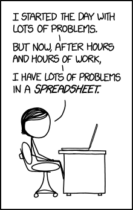

```{r loadscripts, echo=FALSE, message=FALSE, warning=FALSE}
library(here)
library(kableExtra)
data_source <- here("scripts/data_exercises.R")
source(data_source)

```
#Learning Objectives

* Become familiar with tidy data principles.

* Develop a basic understanding of SQL and what is used for.

* Learn how field work becomes data work.

---
# Grounding and Icebreaker
.pull-left[
*On the card in front of you write the following:*
  * Name
  
  * Extension
  
  * What you want out of this training?
  
  * Spotify, iTunes, or analog
  
  * Favorite social network
    * Facebook, twitter, tumblr, instagram, reddit, other...
]

.v-middle[.pull-right[]]

---
## Step 2: Sort this data!
.center[]
---
# What is tidy data?
.center[]

---
# Tidy Data Principles
.pull-left[
### Academic Terms
1. Each variable is atomic 

2. Each variable forms a column

3. Each observation forms a row

4. Each type of observational unit forms a table
]
.pull-right[
### Real Life Examples
1. Separating first and last names

2. First Name Column, DOB Columns

3. Martin, Gleason, 7/14/197

4. Birthday Table
]

.footnote[Source: [Hadley Wickham's Paper](https://vita.had.co.nz/papers/tidy-data.pdf)]

---
# Exercise #1: Tidy This Table
```{r clerks_table, echo = FALSE}

clerks[1:20, 1:4] %>% 
  kable() %>%
  kable_styling(bootstrap_options= c("responsive","striped")) %>% 
  scroll_box(width = "100%", height = "75%")
```

---
# Exercise #1 Results

.pull-left[
1. Each variable is atomic 

2. Each variable forms a column

3. Each observation forms a row

4. Each type of observational unit forms a table
]

.pull-right[
1. Names are not atomic

2. Missing First Name, Last Name

3. More than one "observation"

4. It is one table. Should it be?
]

---
# Database vs Spreadsheet: 
##Completely Oversimplified

.pull-left[
  * **Spreadsheets:**
    * Collect and track whatever you want however you want.

* **Database:**
    * Stricter rules about what can go where and how it is displayed. 
    * Scalability
]

.pull-right[

]

---
# Exercise 2: Think Like A Spreadsheet
.pull-left[]
.pull-right[
**As a group, make a spreadsheet that tracks:**

  * Customer info
  * Store order
  * What they ordered
  * Delivery method
  * Making a return
]

???
use note cards and sticky notes
---

#Databases and SQL: A Little Bit of Theory

  * [Databases are built on Set Theory](https://medium.com/basecs/set-theory-the-method-to-database-madness-5ec4b4f05d79)

  * Tidy principles are a simplification of normalization

    * Deconstructing relationships to their most basic elements

 
  * Structured Query Language was created in 1970 by IBM
  
  * There are many flavors of SQL for working with a variety of database products
  
---

# Database Products

  * Oracle: **MySQL**, Oracle Database

  * Microsoft: Access, **Microsoft SQL Server**
  
  * PostgreSQL Global Development Group: **PostgreSQL**
  
  * SQLite Consortium: **SQLite**
  
  * IBM: DB2
  
  * SAP: SAP Sybase

---

# Database Products

  * MySQL: Hugely popular for websites, free, and used by a number of online learning companies because it is ubiquitous.
  
  * SQL Server: Hugely popular with companies who use Microsoft products. 
    * What JEMS used and cFive WILL use
  
  * PostgreSQL: Free, fast, and well supported by a community of developers
  
  * SQLite: Free, popular for tablets/phones. 
    * Use a single file structure where other products use multiple, interlinked files
  
---

# Database vs Database Administration

.pull-left[
  * Rules, logins, who can access what data: Database Administration
    * Uses command line or a graphic user interface
    * Is not always a SQL command
    
  * Loading, Accessing, Transforming, and Manipulating Data
    * This is done by SQL
    
]

.pull-right[
Microsoft SQL Server Studio

]

---
# Bonus Slide: By Command Line


---
# Break Time
.center[]

---
#What We Learned So Far

--
  * Spreadsheets and databases are different tools for data collection and analysis
  
--
  
  * Tidy data is a way to store data to make processing it easier

--

  * Tidy data is a simplification of normalizing databases

--

  * Structured Query Langauge (SQL) is used for a number of database products. 

--
  
  * Database Administration is about more than running queries.

---
# Notes about the data set
.pull-left[]

.pull-right[
  * Far from an ideal data set

  * We use mortality rates as a key performance indicator
  
  * This data is publically available, which means we can use it and manipluate without fear of violating confidentiality
  
  * Tracking this data can help us develop interventions to prevent these fatalities
]

---
```{r me, echo=FALSE, message=FALSE}
library(RSocrata)
#medical_examiner <- read.socrata("https://datacatalog.cookcountyil.gov/resource/xswi-76cy.json")


```